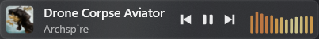

<div align="center">

# Threnody

**Your music lives in the taskbar, not in another window.**

[](https://github.com/Juyens/Threnody/releases/latest)
[](https://en.cppreference.com/w/cpp/20)
[](#)
[](https://www.spotify.com/)
[](#building-from-source)



</div>

---

## What it is for

There is dead space in the Windows 11 taskbar, and checking what is playing means alt-tabbing
to Spotify. Threnody fills that space with the cover, the title, the artist, transport
controls and a spectrum that moves with the music — so glancing down is enough.

It embeds itself into the taskbar rather than floating above it, and it re-embeds on its own
when Explorer restarts or the taskbar changes layout. It hides while a game or a full-screen
video is in front.

## The widget

Every part of it is clickable:

| Click on | What happens |
| :--- | :--- |
| **Cover** or background | Raises Spotify, or minimises it if already in front |
| **Title** | Opens the track in Spotify |
| **Artist** | Opens the artist in Spotify |
| **⏮ ⏯ ⏭** | Previous, play/pause, next |
| **Spectrum** | Cycles the colour mode |

## The spectrum is real

The bars are not decoration. Audio is captured **from Spotify's own process** with WASAPI
process loopback, so it reacts to the music and ignores everything else playing on the system.
Thirteen bars, log-spaced between 40 Hz and 8 kHz through a KissFFT transform, at about 30 fps.

That capture does a second job: Spotify reports play/pause through the Windows media controls
several seconds late, so the widget derives the state from the audio itself and reacts within
tens of milliseconds.

Three colour modes, all computed in **OKLCH** so that every bar reads as equally bright
regardless of hue:

| Mode | What it looks like |
| :--- | :--- |
| **Track** | Every bar in the cover's dominant colour |
| **Rainbow** | The hue circle sweeping across the bars, one turn every 8 s |
| **Gradient** | The cover's colour with hue and lightness rippling around it |

## Lock-key overlay

Windows never tells you whether Caps Lock just went on. Threnody shows a flyout when it does —
and for Num Lock, Scroll Lock and Insert as well. Each key can be turned off on its own, and
the whole overlay with it.

## Connecting Spotify (optional)

It works without this. Title and artist clicks just open a Spotify search instead of the exact
track. To make them exact:

1. Create an app in the [Spotify developer dashboard](https://developer.spotify.com/dashboard).
2. Add `http://127.0.0.1:38417/callback` as its redirect URI.
3. Paste the Client ID into the settings window and connect.

Authorisation uses **PKCE**, so there is no client secret to keep. The refresh token is
encrypted with DPAPI before it is written to disk, and it never leaves your machine.

## Settings

A tray icon opens the settings window: colour mode, which lock keys to watch, start with
Windows, interface language (English or Spanish) and a live view of the log, which is also
written to `%LOCALAPPDATA%\Threnody\threnody.log`.

## Requirements

Windows 11 and the Spotify desktop app. A single **1.6 MB executable**, statically linked —
there is no installer, no runtime to add, and nothing is written outside `%LOCALAPPDATA%`.

Rendering goes through the GPU: Direct2D on Direct3D 11, composed into the taskbar with
DirectComposition so the widget stays transparent over whatever Windows paints behind it.

## Dependencies

Three libraries, pulled by vcpkg and linked statically:

| Library | Version | What it does |
| :--- | :--- | :--- |
| [Dear ImGui](https://github.com/ocornut/imgui) | 1.92.8 | The settings window (DX11 + Win32 backends) |
| [KissFFT](https://github.com/mborgerding/kissfft) | 131.2.0 | The transform behind the spectrum |
| [nlohmann/json](https://github.com/nlohmann/json) | 3.12.0 | Settings file and Spotify Web API replies |

Everything else is Windows itself: Direct2D, DirectWrite and WIC for drawing, Direct3D 11 and
DirectComposition for the surface, WASAPI for the audio capture, WinRT for the media controls,
and DPAPI for the token at rest.

## Building from source

Visual Studio 2026 with the C++ workload, and vcpkg through `VCPKG_ROOT`:

```bash
cmake --preset x64-release
cmake --build out/build/x64-release
```

The binary lands in `out/build/x64-release/Threnody/`. There is a second target with checks
for the parts that do not need a screen — colour conversion, spectrum, layout, settings, PKCE
and the loopback listener:

```bash
cmake --build out/build/x64-release --target ThrenodyTests
./out/build/x64-release/Threnody/ThrenodyTests.exe
```
